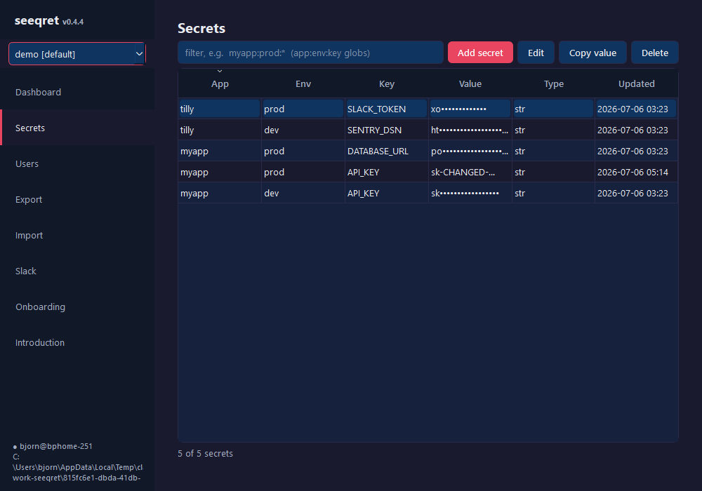
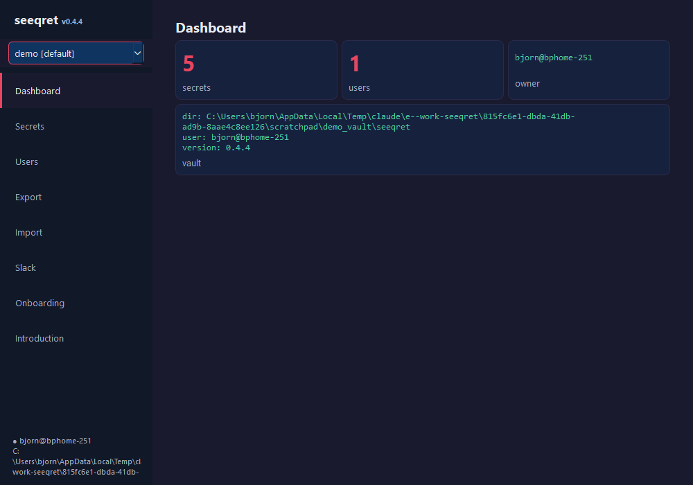
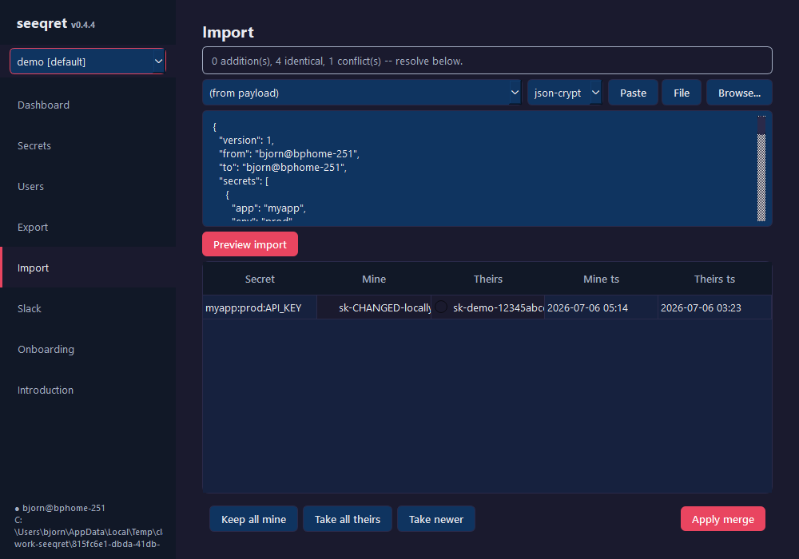
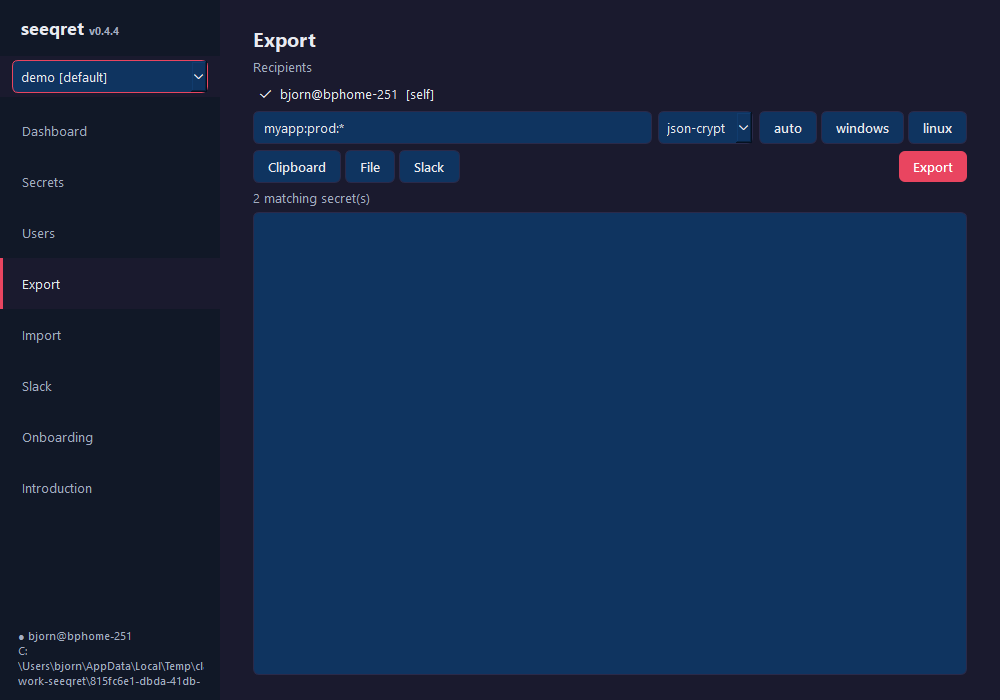
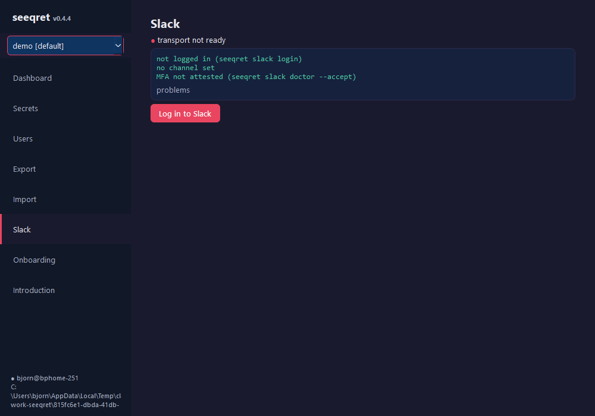
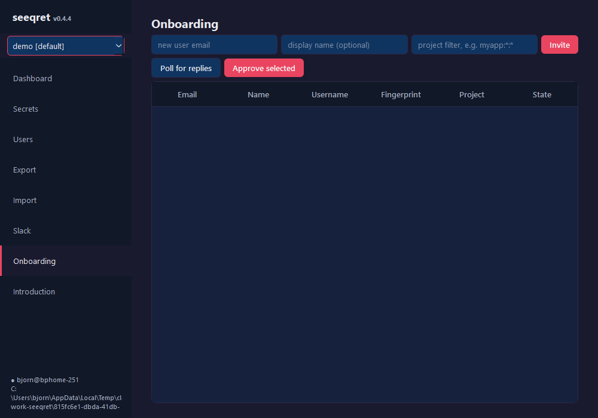
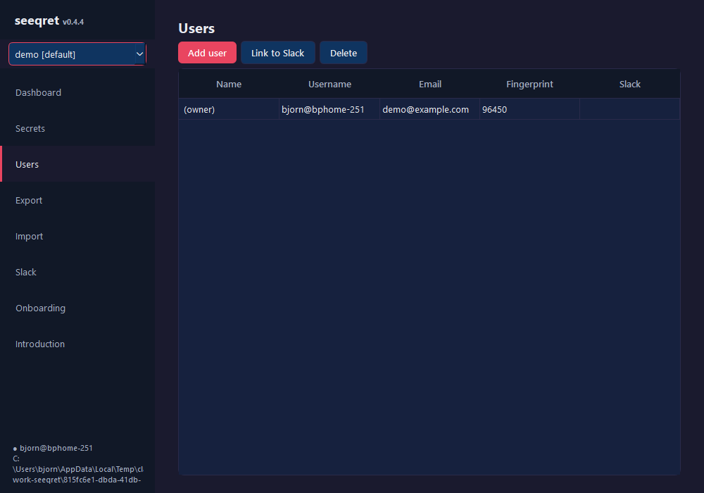
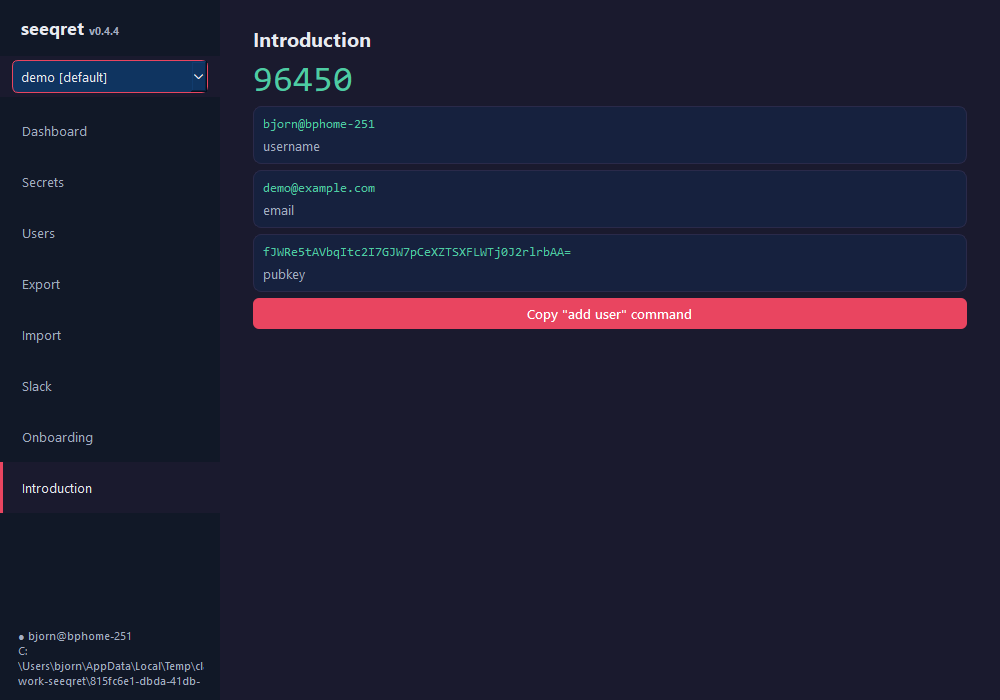

# PySide6 GUI -- Investigation and Design

## Context

seeqret has two front ends today: the Python CLI (this repo) and the
Electron/Svelte app **jseeqret**. They share a vault format (key files +
SQLite, schema-mirrored migrations), so a user can point either tool at the
same vault. The question investigated here: what would a *native Python*
GUI look like, built with PySide6 (Qt), living inside this repo?

Why bother when jseeqret exists?

- **No Electron footprint** -- PySide6 ships as wheels; the GUI becomes
  `pip install seeqret[gui]` + `seeqret-gui` (or `python -m seeqret.gui`).
  No node/pnpm toolchain, no auto-updater infrastructure, no second
  codebase for the crypto.
- **Zero IPC layer** -- jseeqret needs preload/contextBridge/ipcMain
  plumbing between renderer and backend. A Qt GUI calls
  `SqliteStorage`, `Secret`, and the serializers *in-process*. Every one
  of jseeqret's ~40 IPC channels collapses into a direct method call.
- **Same battle-tested core** -- the GUI reuses the exact code paths the
  CLI uses (Fernet at rest, NaCl in transit, migration ladder), so there
  is no risk of the two front ends drifting the way jseeqret and seeqret
  must be manually mirrored today.

## What jseeqret does (the target to match)

A single fixed-size window (1000x700), dark theme only, with a persistent
left sidebar driving a swapped main pane. Seven views:

| View | Purpose |
|---|---|
| Dashboard | Stat cards (secrets/users/owner), vault info, quick actions |
| Secrets | Sortable/filterable table; add form; copy/reveal/edit/delete |
| Users | User table; add/edit/delete; Slack link ceremony; intro inbox |
| Export | Recipient picker, glob filter, clipboard/file/Slack output |
| Import | Paste/file input, two-phase merge with conflict resolution |
| Introduction | Own identity/pubkey/fingerprint + copyable add-me command |
| Onboarding | Team-lead panel: invite, poll, approve (Slack ceremony) |

Plus a first-run **onboarding wizard** and a **vault switcher** dropdown in
the sidebar. Notable interaction details worth copying:

- Secret values are masked; click to reveal, per-row copy button with a
  brief checkmark confirmation.
- Secret identity (app:env:key) is immutable -- edit changes value only.
- The owner row in Users is protected (no delete, no re-key).
- Import is two-phase: dry-run returns conflicts, a Mine/Theirs table
  resolves them, then the merge is applied.
- Fingerprint ceremonies (verify a colleague over a voice call) gate the
  Slack transport.

There is **no unlock screen** in either front end: the vault is "unlocked"
by filesystem access to `seeqret.key`/`private.key` (EFS + ACLs on
Windows). A Qt GUI needs no master-password flow -- adding one would be a
new concept, out of scope.

## Qt mapping

The Electron shell maps onto Qt almost mechanically:

| jseeqret | Qt |
|---|---|
| Sidebar + swapped pane | `QListWidget` + `QStackedWidget` |
| Svelte view component | `QWidget` subclass per view |
| Secrets/users tables | `QTableView` + `QAbstractTableModel` + `QSortFilterProxyModel` |
| Custom modal overlays | `QDialog` |
| Onboarding wizard | `QWizard` |
| Segmented toggles (Clipboard/File/Slack) | `QButtonGroup` of checkable buttons |
| `refresh_key` remount after mutation | re-query the model, `layoutChanged` |
| CSS custom properties | one QSS stylesheet (same palette) |
| Native file dialogs via Electron `dialog` | `QFileDialog` |
| Clipboard via navigator API | `QGuiApplication.clipboard()` |
| Toast/banner alerts | inline `QLabel` banners (same as jseeqret) |

The dark palette transfers directly as QSS constants: bg `#1a1a2e`, card
`#16213e`, input `#0f3460`, sidebar `#111827`, accent `#e94560`, success
`#4ecca3`, border `#2a2a4a`, monospace for keys/values/fingerprints.

## Architecture

```
seeqret/gui/
    __init__.py
    __main__.py         python -m seeqret.gui
    vault_facade.py     the ONLY module that talks to seeqret core
    theme.py            QSS stylesheet (jseeqret palette)
    main_window.py      shell: sidebar + stacked views
    views/              one module per view (prototype inlines these)
```

### The facade is the design centerpiece

jseeqret's cleanest property is its three-layer split: renderer never
touches the database, it goes through the IPC surface. The Qt equivalent
is a **facade module** (`vault_facade.py`) that is the only GUI code
importing from `seeqret.storage` / `seeqret.models`. Each jseeqret IPC
channel becomes one facade method:

| IPC channel | Facade method | Core call |
|---|---|---|
| `vault:status` | `vault_status()` | `run_utils.is_initialized`, `fetch_admin` |
| `secrets:list` | `list_secrets(filterspec)` | `FilterSpec` + `SqliteStorage.fetch_secrets` |
| `secrets:add` | `add_secret(...)` | `Secret(plaintext_value=...)` + `add_secret` |
| `secrets:update` | `update_secret_value(...)` | `update_secret` |
| `secrets:remove` | `remove_secret(...)` | `remove_secrets` |
| `users:list` | `list_users()` | `fetch_users` + `nacl_backend.fingerprint` |
| `vault:introduction` | `introduction()` | `fetch_user(qualified_user())` |
| `secrets:export` | `export_secrets(...)` | serializers registry (needs de-Click refactor) |
| `secrets:import` | `import_secrets(...)` | `seeqret_transfer.import_secrets` |

Two properties make this work with **no changes to core**:

1. `SqliteStorage.connection()` and `Secret.value` resolve the vault via
   `get_seeqret_dir()` (absolute, from the `SEEQRET` env var) -- not via
   the CWD. The CLI's `with seeqret_dir():` chdir wrapper is unnecessary
   for storage/model calls; the GUI only needs `SEEQRET` set.
2. `fetch_secrets` returns `Secret` objects whose `.value` property
   decrypts transparently, exactly what table models want.

The facade also gives us the seam for later: when multi-vault switching
arrives, only the facade re-reads `SEEQRET`; when operations move to a
background thread (`QThread` for Slack polling / export), the facade is
what the worker wraps.

### Threading

Local SQLite + Fernet operations are milliseconds -- fine on the GUI
thread (jseeqret does the same over IPC). Only Slack operations (login
OAuth, send/receive, onboarding polls) and big exports need a
`QThread`/worker; same boundary jseeqret draws with its async handlers.

### Entanglement tax (core refactors a full GUI would need)

The read/write path is clean, but three flows mix Click I/O into logic:

- `seeqret_transfer.export_secrets(ctx, ...)` takes a Click context and
  `click.echo`s progress. Needs the logic lifted into a ctx-free function
  the CLI wraps. (~small refactor)
- `resolve_user` / `resolve_recipients` raise `click.ClickException` --
  fine to catch, but a neutral `SeeqretError` would be cleaner.
- `seeqret_init.secrets_init` echoes and calls `os.abort()` on failure.
  A GUI "create vault" needs the abort turned into an exception.

None of these block a read-mostly GUI; all three are needed before the
Export/Import/Init views can ship.

## Phasing (all four phases now on this branch)

1. **Prototype**: shell + facade + Dashboard, Secrets, Users,
   Introduction. ✔
2. **Transfer views**: de-Click `export_secrets`/`resolve_user`, build
   Export (recipients, serializer, clipboard/file/Slack) and Import
   with the two-phase conflict table. ✔
3. **Vault lifecycle**: create-vault dialog (de-Click `secrets_init`),
   vault switcher over the shared registry, first-run view. ✔
4. **Slack**: login/status/attest/selftest, link ceremony, Slack
   export, onboarding panel. Slack calls run on worker threads. ✔

## Core ports added for parity (usable by CLI too)

The GUI work surfaced functionality jseeqret had that the Python core
lacked. These are now proper core modules, independent of Qt:

- `seeqret/errors.py` -- `SeeqretError(ClickException)` with an
  ANSI-free ``plain`` message; `resolve_user` errors and
  `seeqret_init`'s former ``os.abort()`` paths now raise these.
- `seeqret/vault_registry.py` -- `~/.seeqret/vaults.json`,
  byte-compatible with jseeqret's registry (flat name->path map with
  a ``_default`` marker), so both tools share registered vaults.
- `seeqret/merge.py` -- two-phase import merge
  (plan/conflicts/resolutions, ``mine``/``theirs``/``newer``).
- `seeqret/serializers/jsoncrypt_serializer.py` -- payload aligned to
  jseeqret's shape (``from``/``to`` are usernames; ``signature`` is
  the 5-char fingerprint over the encrypted-secrets array) and
  **`load` implemented** -- json-crypt import previously raised
  ``NotImplementedError``, which also broke ``slack receive``.
- `seeqret/serializers/user_list_serializer.py` +
  `seeqret/serializers/envelope.py` -- the onboarding exchange
  formats (`{v, kind, payload}` envelope, encrypted user lists).
- `seeqret/onboarding.py` -- the full TL/new-user state machine
  (invite/introduce/poll/approve/provision/ack) mirroring
  jseeqret's onboarding.js, including the constant-time
  ``pubkeys_equal`` trust anchor and the two Box-authenticated
  proof plaintexts.
- `seeqret/slack/session.py` + `seeqret/slack/selftest.py` --
  preflight-asserted transport context and the loopback selftest.
- `SqliteStorage.onboarding_*` -- row CRUD for the (already
  schema-mirrored) onboarding table.

Covered by `tests/test_parity_core.py` (registry shape, envelope,
json-crypt roundtrip, merge semantics, user-list crypto, onboarding
rows + TTL expiry, facade conflict flow).

## Known divergences from jseeqret

- No per-column filter row on the secrets table (the glob FilterBar
  covers app:env:key filtering); click-to-sort works via
  `QSortFilterProxyModel`.
- The onboarding poll cursor advances only past *handled* messages;
  jseeqret's stale-noise fast-forward (`STALE_AFTER_SECONDS`) is not
  ported (correct, less efficient on noisy channels).
- No auto-update UI (pip/PyInstaller distribution instead of
  electron-updater) and no new-user first-run `QWizard` yet -- the
  first-run view covers vault creation; a wizard walking
  invite-verify-introduce-wait is the natural next step.
- Slack-dependent flows (OAuth login, send/receive, onboarding
  traffic, selftest) are wired end-to-end but have not been exercised
  against a live workspace from this GUI.

## Packaging

- `setup.py`: `extras_require={'gui': ['PySide6']}` and a
  `seeqret-gui = seeqret.gui.__main__:main` console entry (gui_scripts on
  Windows so no console window flashes).
- PySide6 is ~180 MB installed; keeping it an extra keeps the core CLI
  slim for servers (`server init` machines must never grow a Qt
  dependency).

### PyInstaller one-file (investigated, works)

`packaging/seeqret-gui.spec` builds a standalone windowed exe:

```
pyinstaller packaging/seeqret-gui.spec --noconfirm
```

Measured results (PyInstaller 6.21, Python 3.13, Windows 11):

- `dist/seeqret-gui.exe`: **32.5 MB**, no console window, needs only
  the `SEEQRET` env var -- same contract as the CLI.
- Cold start to visible window: **~2 s** (onefile unpacks to a temp
  dir on every launch; a onedir build would start faster at the cost
  of shipping a folder).
- Build time: ~1 minute.

The spec keeps the size down by excluding the Qt modules the GUI
never imports (QtNetwork/QtQml/QtQuick/WebEngine/Pdf), the software
OpenGL fallback DLL (~20 MB), and the Qt translation catalogs.
`packaging/launch_gui.py` exists because PyInstaller needs a
top-level entry script (the gui package uses relative imports).

Notes for a real release:

- The exe is unsigned; SmartScreen will warn on first run. Code
  signing is the same problem jseeqret already solves with its
  `sign.js` -- reuse that certificate.
- No icon yet (`icon=` in the spec's EXE block once one exists).
- PyInstaller must run on the target OS; a Windows exe needs a
  Windows build (CI matrix job per platform).

## What is on this branch

`seeqret/gui/` implements all eight views against a live vault
(`python -m seeqret.gui`; vault resolution is registry-default first,
then `SEEQRET`, like jseeqret):

Dashboard, Secrets (glob filter, sort, masked values, reveal, copy,
add/edit/delete), Users (add/delete, owner protection, Slack link
ceremony), Export (grouped recipients, serializer, system toggle,
clipboard/file/Slack), Import (paste/file, two-phase conflict table
with bulk keep-mine/take-theirs/take-newer), Slack (status card,
OAuth login + channel pick, MFA attest, transport selftest, logout),
Onboarding (invite, poll, fingerprint-gated approve), Introduction.

The sidebar hosts the vault switcher (create/register/switch); an
uninitialized start lands on a first-run view with vault creation.

Screenshots (against a throwaway demo vault):
















